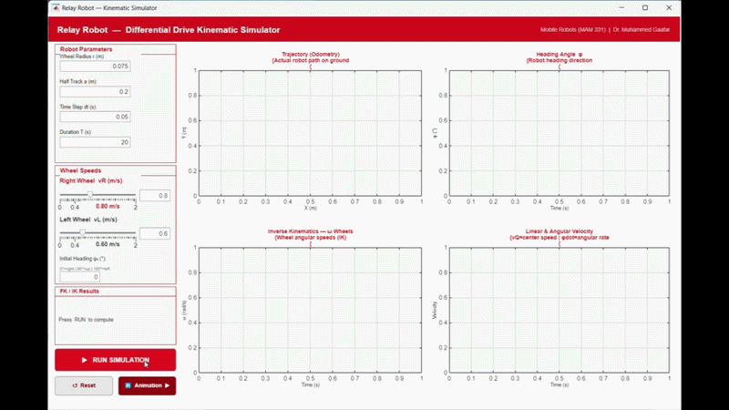

# Relay Robot Kinematics Simulation

MATLAB-based simulation and kinematic analysis for the Relay Autonomous Service Robot using a Differential Drive Mobile Robot model.

## Project Overview

This project was developed as part of the **Mobile Robots (MAM 331)** course at the Faculty of Engineering, Benha University.

The main objective of this project is to study and simulate the motion behavior of an Autonomous Mobile Robot (AMR) operating with a Differential Drive mechanism, similar to the Relay hospital delivery robot developed by Relay Robotics.

The project focuses on understanding how robot motion is mathematically modeled and how kinematic equations are applied in real robotic systems used in healthcare environments.

---

## Topics Covered

- Differential Drive Mobile Robots
- Forward Kinematics
- Inverse Kinematics
- Robot Motion Analysis
- Odometry Estimation
- Wheel Velocity Calculations
- Robot Turning Behavior
- MATLAB GUI Simulation
- Autonomous Mobile Robot Fundamentals

---

## Project Files

### `kinmatics.m`
Contains the mathematical implementation of:
- Forward Kinematics
- Inverse Kinematics
- Linear velocity calculations
- Angular velocity calculations
- Robot motion equations

### `RelayRobotGUI.m`
Graphical User Interface (GUI) developed in MATLAB for:
- Visualizing robot motion
- Simulating differential drive behavior
- Displaying wheel velocity effects
- Demonstrating robot trajectory and turning motion

---

## MATLAB Simulation

The simulation was created to provide a practical visualization of the robot’s motion and kinematic behavior.

The implemented model demonstrates:
- Robot linear and angular motion
- Differential wheel speed effects
- Clockwise and counterclockwise turning
- Motion trajectory generation
- Kinematic validation using mathematical equations

This helped bridge the gap between theoretical robotics concepts and practical implementation.

---

## PEAS & ODESA Analysis

As part of the case study, the robot was also analyzed using:

### PEAS Framework
- Performance
- Environment
- Actuators
- Sensors

### ODESA Environment Analysis
- Observable
- Deterministic
- Episodic
- Static
- Agents

These analyses helped classify the robot as an intelligent autonomous agent operating in a dynamic healthcare environment.

---

## Technologies Used

- MATLAB
- MATLAB GUI
- Robotics Kinematics
- Differential Drive Modeling

---

## Real-World Inspiration

This simulation was inspired by the Relay Autonomous Service Robot developed by Relay Robotics, which is designed for healthcare delivery applications such as:
- Medication delivery
- Lab sample transportation
- Medical supply logistics

The robot combines autonomous navigation, intelligent sensing, and obstacle avoidance technologies to operate safely inside hospitals.

---

## Learning Outcomes

Through this project, we gained practical understanding of:
- Mobile robot kinematics
- Autonomous navigation concepts
- Robot motion modeling
- MATLAB-based robotic simulation
- Real-world healthcare robotics applications

---

